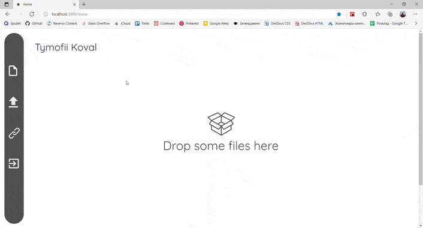

# Filegraber

Filegraber is minimalistic cloud service and file exchanger written using Next.js. The goal of the app is to make files and links exchange between devices as easy as possible by providing simple UI and UX.

## Technology stack

- Next.js
- React
- TypeScript
